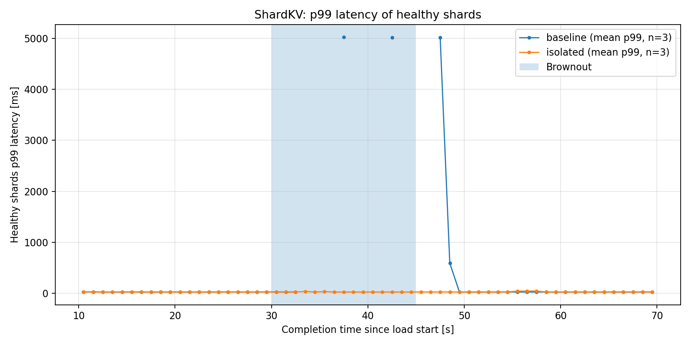
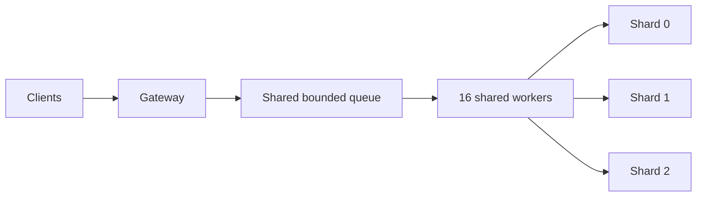
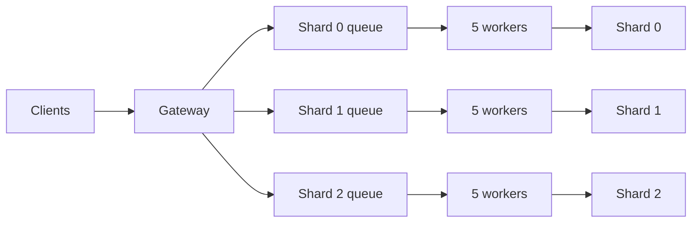

# ShardKV — Fault Isolation in a Sharded Key-Value Service

ShardKV is a small C++17 in-memory key-value service built to explore one practical systems question: **what happens to healthy shards when one backend becomes slow or stops responding?**

The project compares two gateway designs:

- a **baseline** gateway with one shared queue and worker pool;
- an **isolated** gateway with per-shard queues, per-shard workers, backend timeouts, and a simple circuit breaker.



## Key result

In the experiment, shard 2 was paused for 15 seconds while the load generator continued sending requests to all three shards.

| Healthy-shard metric | Baseline | Isolated |
|---|---:|---:|
| Normal throughput | ~4,691 req/s | ~4,643 req/s |
| Throughput during brownout | ~681 req/s | ~4,629 req/s |
| Normal throughput retained | **14.5%** | **99.7%** |
| Normal p99 latency | ~27.2 ms | ~27.3 ms |
| Phase-wide p99 during brownout | ~32.5 ms | ~27.1 ms |
| Mean peak 1 s p99 during brownout | ~5,023 ms | ~47 ms |

The baseline loses most healthy-shard throughput because blocked backend calls occupy workers from the shared pool. In the isolated version, failures on one shard are contained to that shard, while requests for healthy shards keep flowing close to their normal rate.

> The phase-wide baseline p99 looks much lower than the peak 1-second p99 because, during the strongest stall, very few requests complete. The time-series plot is therefore important for showing the short periods of severe head-of-line blocking.

## Architecture

### Baseline



All shards compete for the same workers. If calls to one backend block, those workers cannot serve requests for other shards.

### Isolated gateway



Each shard gets its own bounded queue and worker pool. Backend calls have a 250 ms timeout; after a failure, the corresponding circuit breaker opens for 1 second and requests to that shard fail fast until a probe succeeds.

For a more detailed walkthrough, see [docs/architecture.md](docs/architecture.md).

## How it works

ShardKV consists of three in-memory backend processes and one gateway. Keys are assigned to shards using deterministic FNV-1a hashing, so the C++ gateway and Python load generator agree on the shard for every key.

The protocol is deliberately small and text based:

```text
42 PUT user-123 hello
42 OK

43 GET user-123
43 OK hello
```

Supported operations are `GET`, `PUT`, and `DELETE`.

## Build

Requirements:

- Linux
- a C++17 compiler (GCC or Clang)
- CMake 3.16+
- Python 3
- `matplotlib` and `pandas` only for analysis/plotting scripts

Build the C++ binaries:

```bash
cmake -S . -B build -DCMAKE_BUILD_TYPE=Release
cmake --build build -j
```

Optional Python dependencies:

```bash
python3 -m pip install -r requirements.txt
```

## Local demo

The original measurements were collected on multiple Raspberry Pi nodes, but the whole system can also be run locally on one Linux machine.

Run either gateway version:

```bash
./run_local_demo.sh baseline
./run_local_demo.sh isolated
```

The script starts three backend processes on localhost, starts the selected gateway, seeds the key space, runs a short workload, and stores generated files under `results/local/`.

The demo is intentionally shorter than the original experiment. Environment variables can be used to change the workload, for example:

```bash
DURATION=30 CLIENTS=64 KEYS=100000 ./run_local_demo.sh isolated
```

## Reproduce a local brownout

A local failure can be injected without SSH or university infrastructure:

```bash
./run_local_brownout.sh baseline
./run_local_brownout.sh isolated
```

The script pauses backend 2 with `SIGSTOP`, keeps the workload running, and resumes it with `SIGCONT` after the configured brownout window.

Default local settings are intentionally compact. They can be changed through environment variables:

```bash
DURATION=70 \
WARMUP=10 \
CLIENTS=64 \
BROWNOUT_AT=30 \
BROWNOUT_SECONDS=15 \
KEYS=100000 \
./run_local_brownout.sh isolated
```

The original `run_normal.sh` and `run_brownout.sh` are also kept as small helpers for experiments where the gateway/backends run on separate machines.

## Original experiment

The portfolio results included in this repository used:

- 64 concurrent clients;
- 100,000 keys;
- 90% `GET`, 8% `PUT`, 2% `DELETE`;
- deterministic seed `42`;
- 10 s warm-up;
- 70 s load run;
- shard 2 paused from `t=30 s` to `t=45 s`;
- three runs per architecture/configuration.

The measurements were collected on five Raspberry Pi nodes provided by the university: one load generator, one gateway, and three backend nodes. Infrastructure-specific hostnames and IP addresses are intentionally not part of this public repository.

Detailed interpretation and additional plots are in [docs/results.md](docs/results.md). The compact aggregated data is available in [`measurements/summary.csv`](measurements/summary.csv).

## Repository layout

```text
.
├── backend.cpp                 # in-memory key-value backend
├── common.hpp                  # protocol, hashing, networking helpers
├── gateway_baseline.cpp        # shared queue / shared worker pool
├── gateway_isolated.cpp        # per-shard isolation + timeout + circuit breaker
├── loadgen.py                  # concurrent workload generator
├── seed_data.py                # initial key seeding
├── analyze.py                  # latency/throughput analysis for raw load traces
├── queue_plots.py              # plots from gateway metrics
├── run_local_demo.sh           # local functional demo
├── run_local_brownout.sh       # local brownout reproduction
├── run_normal.sh               # multi-host normal-run helper
├── run_brownout.sh             # multi-host SSH brownout helper
├── measurements/               # compact portfolio results, not full raw traces
└── docs/
    ├── architecture.md
    └── results.md
```

## Analysis scripts

`analyze.py` accepts raw load-generator CSV files and produces an aggregated summary plus the healthy-shard p99 timeline.

`queue_plots.py` works with the small gateway metric samples retained in `measurements/` and can regenerate the queue-behavior plots:

```bash
python3 queue_plots.py
```

## Limitations

The fixed three-shard setup keeps the project focused on failure propagation, queueing behavior, and fault isolation.
