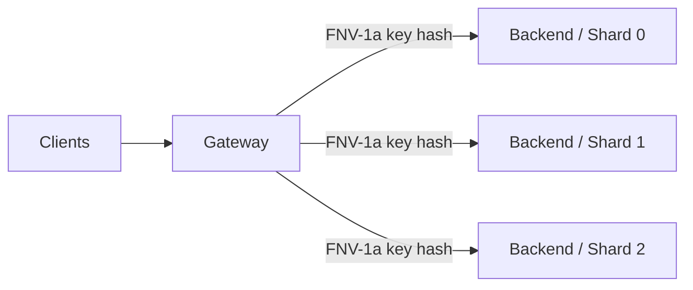
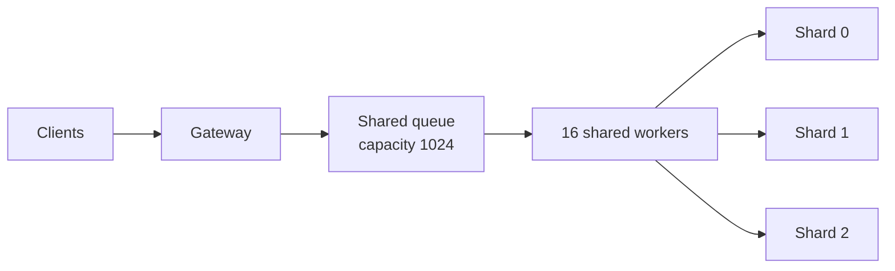
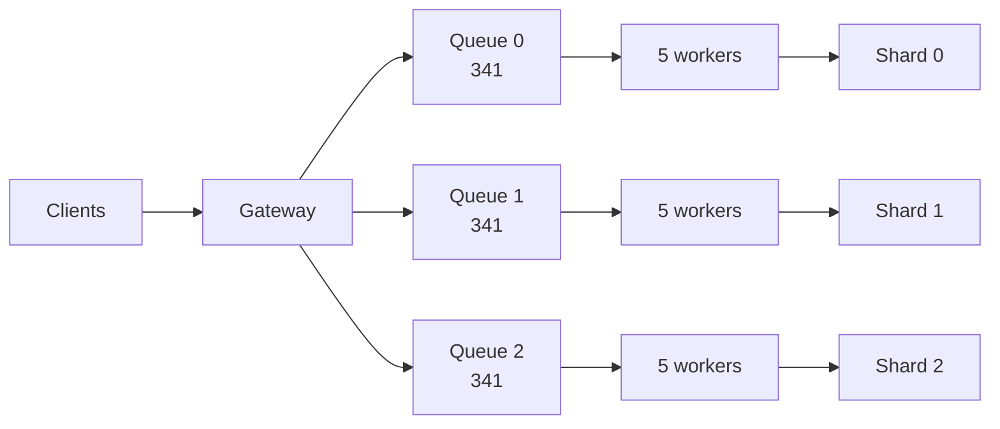

# Architecture

## Components

The system has four server-side processes:

1. one **gateway** listening for client requests;
2. three independent **backend** processes holding in-memory key/value maps.

Clients talk only to the gateway. The gateway hashes every key and forwards the request to one backend.



The load generator uses the same FNV-1a mapping as the C++ gateway,
which makes it possible to separate metrics for the affected shard and the healthy shards.

## Baseline gateway

The baseline architecture has:

- one bounded queue with capacity 1024;
- 16 workers shared by all shards;
- blocking backend calls.



Under normal conditions this is simple and works well.
The weakness appears when a backend stops responding: workers assigned to that shard remain blocked,
leaving fewer workers for unrelated requests. As more workers become occupied,
healthy shards experience head-of-line blocking and throughput collapses.

## Isolated gateway

The isolated architecture divides the same basic resources by shard:

- three queues with capacity 341 each;
- five workers per shard (15 total);
- a 250 ms backend timeout;
- one circuit breaker per shard;
- a 1 s circuit-open interval before a probe is allowed.



A stalled shard can now consume only its own workers and queue. Healthy shards keep their own capacity.

## Circuit-breaker behavior

The circuit breaker is deliberately minimal:

1. requests are forwarded normally while the backend is healthy;
2. a timeout or connection failure opens the circuit for that shard;
3. requests to the open circuit fail fast instead of occupying workers;
4. after 1 second, one request is allowed through as a probe;
5. a successful probe closes the circuit; another failure opens it again.

The breaker is not intended as a reusable production library.
It exists to demonstrate how fast failure plus resource isolation changes system behavior during a brownout.

## Request protocol

Requests and responses are newline-delimited text messages. Examples:

```text
100 GET key-00000001
100 OK init

101 PUT key-00000001 updated-value
101 OK

102 DELETE key-00000001
102 OK
```

Each request carries a numeric request ID so a client can validate the corresponding response.

## Observability

The gateways record one-second metric windows to CSV. Depending on the gateway version, these include:

- request rate and response statuses;
- queue length;
- average queue wait time;
- active workers;
- workers waiting on each backend;
- per-shard circuit state in the isolated version.

The load generator separately records request completion time, latency, status, shard, and operation.
This is used for throughput and percentile analysis.
