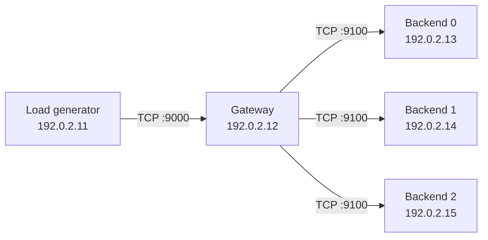

# Multi-Host Experiment Guide

This document describes how to reproduce the original ShardKV experiment on multiple Linux machines.

> [!NOTE]
> All IP addresses below are documentation-only examples from the `192.0.2.0/24` range.

## Reference setup

The original experiment used five Raspberry Pi 4 machines:

| Role | Reference host | Example address |
|---|---|---|
| Load generator | Client | `192.0.2.11` |
| Gateway | Gateway | `192.0.2.12` |
| Backend shard 0 | Backend 0 | `192.0.2.13` |
| Backend shard 1 | Backend 1 | `192.0.2.14` |
| Backend shard 2 | Backend 2 | `192.0.2.15` |

The logical topology is:



The machines should be connected through the same local network.

## Reference hardware and software

The measurements published were collected on the following platform.

### Hardware

- Raspberry Pi 4
- Broadcom BCM2711 SoC
- 4 × ARM Cortex-A72 cores (ARMv8-A)
- AArch64 / 64-bit architecture
- 8 GB RAM
- L1 cache per core:
    - 32 KiB data cache
    - 48 KiB instruction cache
- 1 MiB shared L2 cache
- 64-byte cache line

### Software environment

- Ubuntu 24.04 LTS (ARM64)
- Linux kernel `6.8.0-1063-raspi`
- `perf` version `6.8.12`
- experiment files stored on a RAM-backed / `tmpfs` filesystem
- no persistent local storage was used for the measurements

# Experimental procedure

## 1. Build executable

Clone the same repository on the gateway and backend machines:

```bash
git clone https://github.com/makksmrk/shardkv-fault-isolation.git
cd shardkv-fault-isolation
```

Build the C++ programs:

```bash
cmake -S . -B build -DCMAKE_BUILD_TYPE=Release
cmake --build build -j
```

The build produces:

```text
build/shardkv_backend
build/shardkv_gateway_baseline
build/shardkv_gateway_isolated
```

## 2. Start the backend shards

Run one backend process on each backend machine.

### Backend 0 — `192.0.2.13`

```bash
./build/shardkv_backend 9100 backend0_metrics.csv
```

### Backend 1 — `192.0.2.14`

```bash
./build/shardkv_backend 9100 backend1_metrics.csv
```

### Backend 2 — `192.0.2.15`

```bash
./build/shardkv_backend 9100 backend2_metrics.csv
```

All three backends use port `9100` because they run on separate machines.

## 3. Start the gateway

Run the gateway on the gateway machine (`192.0.2.12`).

### Baseline gateway

```bash
./build/shardkv_gateway_baseline \
  9000 \
  192.0.2.13:9100 \
  192.0.2.14:9100 \
  192.0.2.15:9100 \
  gateway_baseline_metrics.csv
```

### Isolated gateway

For the isolated experiment, stop the baseline gateway and start:

```bash
./build/shardkv_gateway_isolated \
  9000 \
  192.0.2.13:9100 \
  192.0.2.14:9100 \
  192.0.2.15:9100 \
  gateway_isolated_metrics.csv
```

Only one gateway variant should listen on port `9000` at a time.

## 4. Seed the key space

Before the measured run, populate the key space through the gateway from the client machine:

```bash
python3 tools/seed_data.py \
  --host 192.0.2.12 \
  --port 9000 \
  --keys 100000 \
  --timeout 5
```

This gives the load generator a deterministic set of keys for subsequent operations.

## 5. Run the normal workload

The reference workload uses:

- 64 concurrent clients
- 100,000 keys
- 90% `GET`
- 8% `PUT`
- 2% `DELETE`
- random seed `42`
- 10 s warm-up
- 70 s measured workload
- client timeout of 5 s

```bash
python3 tools/loadgen.py \
  --host 192.0.2.12 \
  --port 9000 \
  --clients 64 \
  --duration 70 \
  --warmup 10 \
  --seed 42 \
  --timeout 5 \
  --csv baseline_normal_1.csv
```

Or use script:

```bash
./scripts/run_normal.sh \
  192.0.2.12 \
  baseline_normal_1.csv
```

For the published comparison, the workload was repeated three times for each configuration:

```text
baseline normal
baseline brownout
isolated normal
isolated brownout
```

This results in 12 measured workload runs in total.

## 6. Inject a brownout

The brownout simulates a backend that stops making progress without crashing.

In the reference experiment, backend shard 2 was paused with `SIGSTOP` at `t=30 s` and resumed with `SIGCONT` at `t=45 s`.

The client keeps sending traffic during the entire 15-second brownout.

### 6.1 Find the backend PID

On Backend 2:

```bash
pgrep shardkv_backend
```

Assume the returned PID is:

```text
12345
```

### 6.2 Verify SSH access

The client machine must be able to reach Backend 2 over SSH:

```bash
ssh user@192.0.2.15
```

### 6.3 Run the brownout workload

From the client machine:

```bash
./scripts/run_brownout.sh \
  192.0.2.12 \
  user@192.0.2.15 \
  12345 \
  baseline_brownout_1.csv
```

With an explicit SSH key:

```bash
./scripts/run_brownout.sh \
  192.0.2.12 \
  user@192.0.2.15 \
  12345 \
  baseline_brownout_1.csv \
  ~/.ssh/experiment_key
```

The helper performs the following sequence automatically:

```text
t = 0 s     start workload
t = 30 s    SIGSTOP backend shard 2
t = 45 s    SIGCONT backend shard 2
t = 70 s    workload ends
```

The script also attempts to resume the backend during cleanup if the run is interrupted.


## 7. Analyze the workload traces

After copying the CSV files to one machine, run:

```bash
python3 tools/analyze.py \
  --baseline-normal \
    baseline_normal_1.csv \
    baseline_normal_2.csv \
    baseline_normal_3.csv \
  --baseline-brownout \
    baseline_brownout_1.csv \
    baseline_brownout_2.csv \
    baseline_brownout_3.csv \
  --isolated-normal \
    isolated_normal_1.csv \
    isolated_normal_2.csv \
    isolated_normal_3.csv \
  --isolated-brownout \
    isolated_brownout_1.csv \
    isolated_brownout_2.csv \
    isolated_brownout_3.csv \
  --unhealthy-shard 2 \
  --out p99_healthy_timeline.png \
  --summary summary.csv
```

The analysis produces:

- an aggregated summary CSV;
- a healthy-shard p99 latency timeline;
- normal-vs-brownout comparisons for both gateway variants.


- in the **baseline**, the stalled shard consumes shared workers and degrades otherwise healthy shards;
- in the **isolated** gateway, the impact should remain mostly limited to the affected shard.

## 8. Optional system-level measurements

During the original investigation, additional Linux metrics were used to understand why the baseline slowed down.

Examples:

### Process CPU and scheduler activity

```bash
pidstat -p <GATEWAY_PID> 1
```

### Run queue and context switches

```bash
vmstat 1
```

### TCP socket state

```bash
ss -tinp
```

### CPU profiling

```bash
perf record -F 99 -g -p <GATEWAY_PID>
```

These measurements are mainly useful for understanding of the mechanism behind the observed queueing and worker blocking.