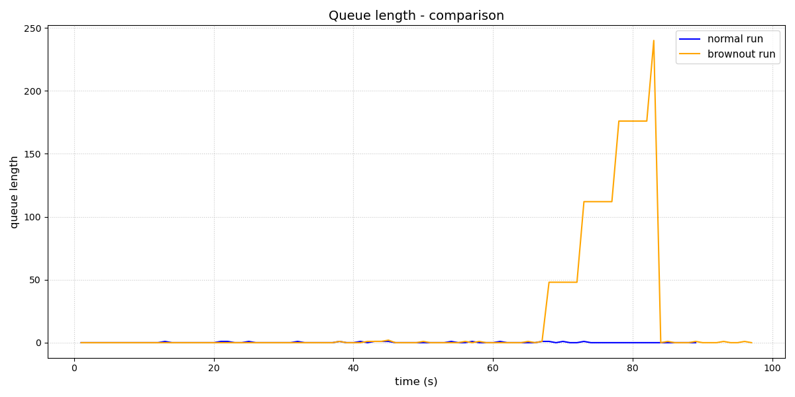
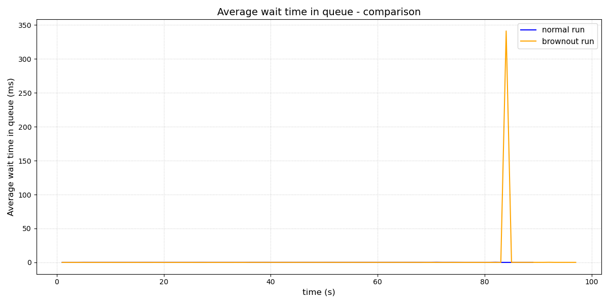
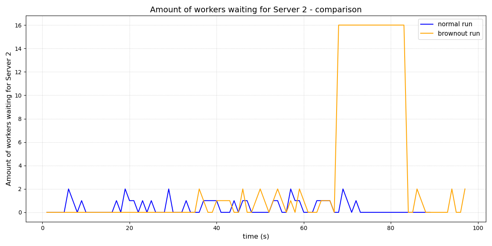
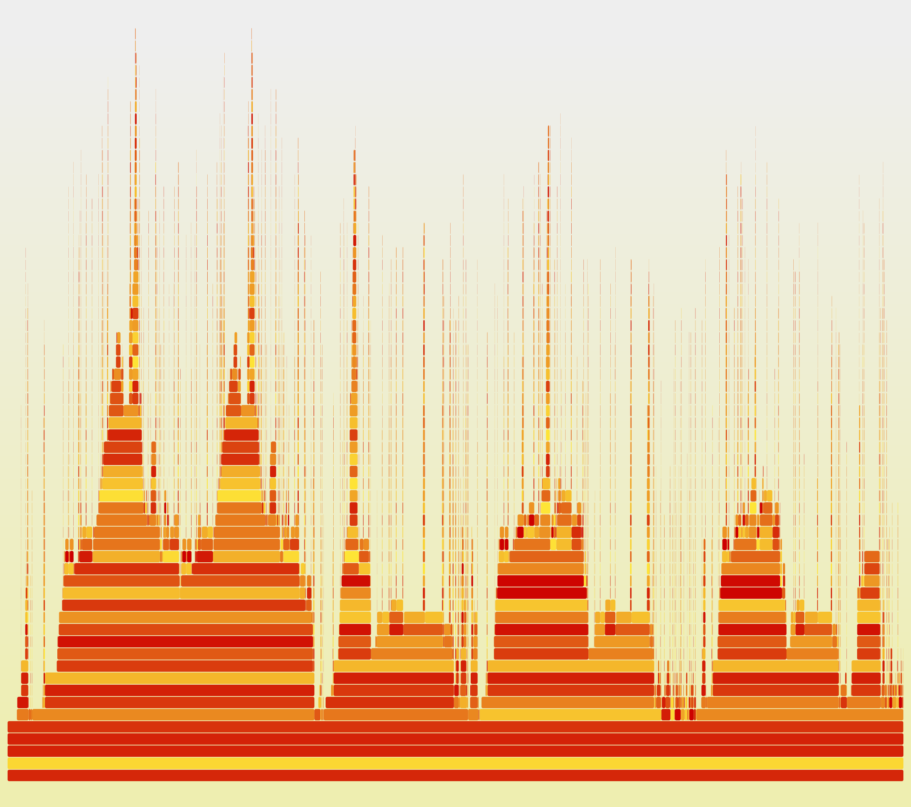
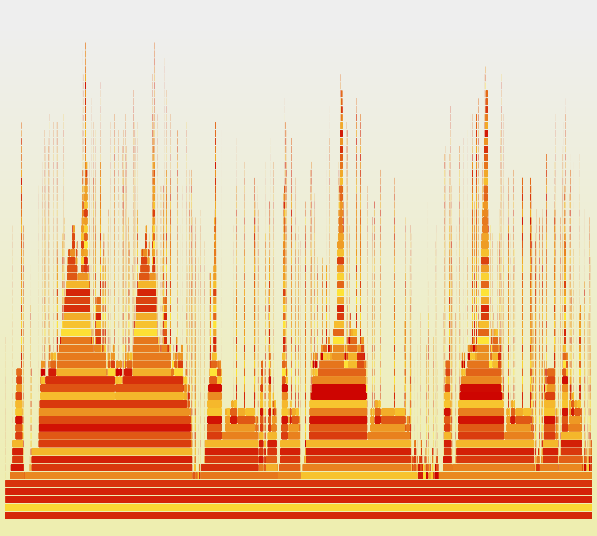

# Experimental Results

## Test setup

The original experiment used five Raspberry Pi nodes: one load generator, one gateway, and three backends.

Workload configuration:

- 64 concurrent clients;
- 100,000 keys;
- 90% `GET`, 8% `PUT`, 2% `DELETE`;
- deterministic seed 42;
- 10 s warm-up;
- 70 s total load duration;
- shard 2 paused at `t=30 s` and resumed at `t=45 s`;
- three runs for each architecture and condition.

## Main result: healthy shards remain available with isolation

| Healthy-shard metric | Baseline | Isolated |
|---|---:|---:|
| Normal throughput | 4,691 req/s | 4,643 req/s |
| Brownout throughput | 681 req/s | 4,629 req/s |
| Throughput retained | 14.5% | 99.7% |
| Normal p99 | 27.18 ms | 27.34 ms |
| Brownout phase-wide p99 | 32.45 ms | 27.07 ms |
| Mean peak 1 s p99 | 5,023 ms | 47 ms |


The baseline architecture shows severe short latency spikes and a large drop in completed requests for healthy shards. With per-shard isolation, healthy-shard throughput and p99 remain close to normal operation.

## Queue behavior in the baseline







These plots help explain the mechanism behind the user-visible latency: requests accumulate in the shared queue while workers wait for the affected backend. Because those workers are shared, the effect propagates beyond shard 2.

The retained metric CSV samples can be replotted with:

```bash
python3 tools/queue_plots.py
```

## CPU profiling  - Flamegraphs

### Normal run



### Brownout run



The flamegraphs are supporting evidence rather than the main result,
but they indicate that the issue is off-CPU and may not be visible in standard on-CPU flamegraphs without
additional diagnostic methods such as the USE Methodology.

## Interpretation

The experiment demonstrates a simple systems principle: **resource sharing can turn a local failure into a wider service degradation**.

The isolated gateway does not make the failed shard healthy. Requests to shard 2 still fail or time out during the brownout.
What changes is the blast radius: shard 2 can no longer consume the queues and workers needed by shards 0 and 1.